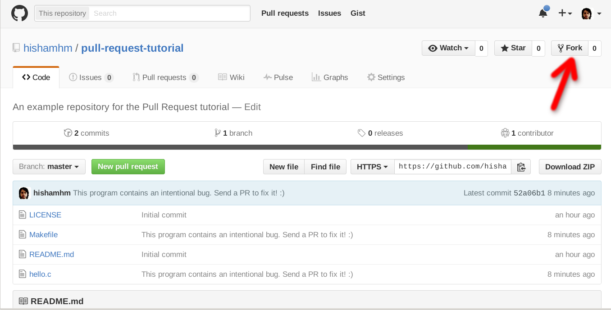
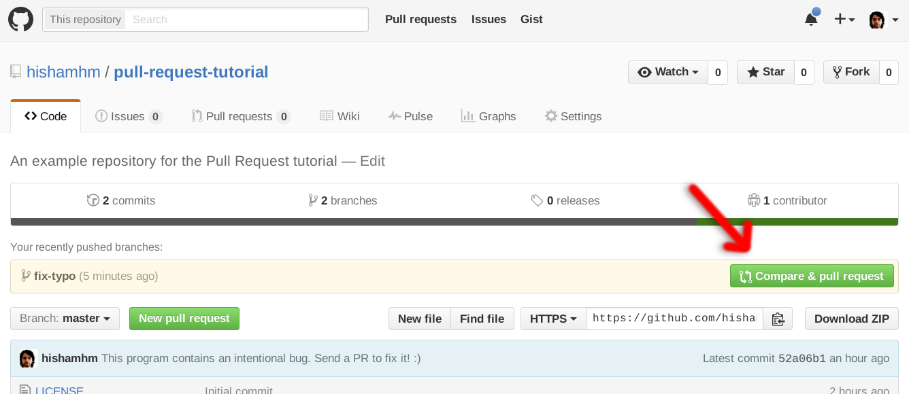
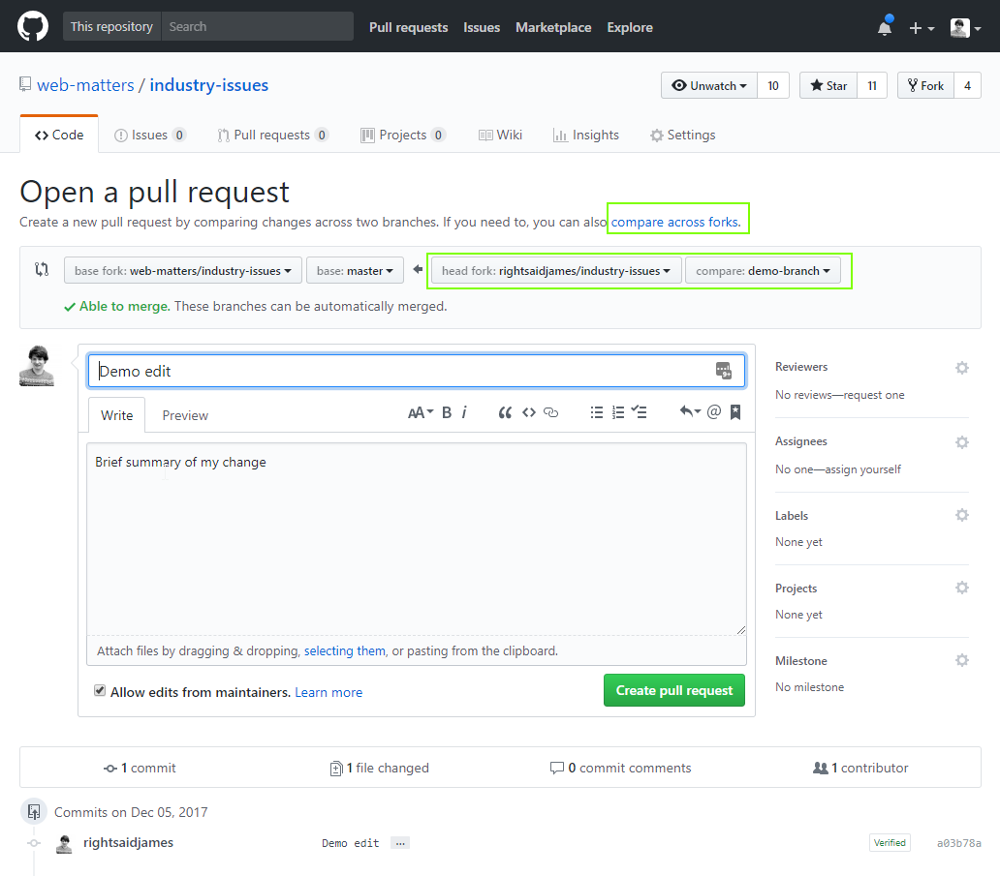

# What is a pull request template?

Exactly what it sounds like: it is a template used for making more efficient, specialised, and better oriented pull requests. In addition to making pull requests, from scratch, we can create a template (a lot like a form) to fill in the information needed to generate the pull request.

## How to make a pull request

### What is a pull request?

A pull request is the process of requesting to change someone's content in their repository. This is done by creating a copy of their repository, making the adequate changes, and notifying the original repository owner of those changes. It will be then up to the owner of the repository to accept or deny the proposed changes.

It is hard to demonstrate this as normal, since more than 1 profile and branches will be needed. That being said, I will try to write the steps as consisely as possible:

Finally, before we begin, an excellent video tutorial on how to make pull requests can be found 👉🏿 [here](https://www.youtube.com/watch?v=rgbCcBNZcdQ) 👈🏿

## How to make a pull request

- **Fork** the repository from which you want to make a pull request.

  - Forking the repo will put a copy of that repo into your local machine, as if it's your own repository.
- **Clone** the forked repo so that you can access the code files in your code editor.
- Once that is done, it is best practise to immediately make a new branch in which the desired changes will be made. 
- Make the appropriate changes to the project. could be one file or multiple files. Depends on what you are changing.
- git: add, commit, and push, your changes to the current branch.
  - Optional: you can then checkout to your master branch and merge the changes from the edited branch to the master branch. But this is not necessary and not a lot of people practise this, as it is not very intuitive.
- Go back to your GitHub page, you likely see a banner likely will see banner like this: 

- Click on compare and pull request, then you will see a page like this (this image is from a different source):

- The left part (base fork and base) should be left untouched, as you are always attempting to merge to their master branch.
- As for us, we select the appropriate fork, as well as the appropriate branch that we would like to use for merging. This is usually left unchanged for the most part, unless someone wants to merge their master branch.
- Add a relevant title and message.
- Click on Create pull request
- Done 👍🏿